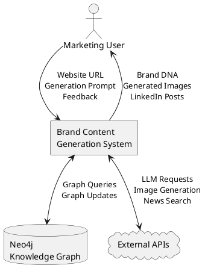
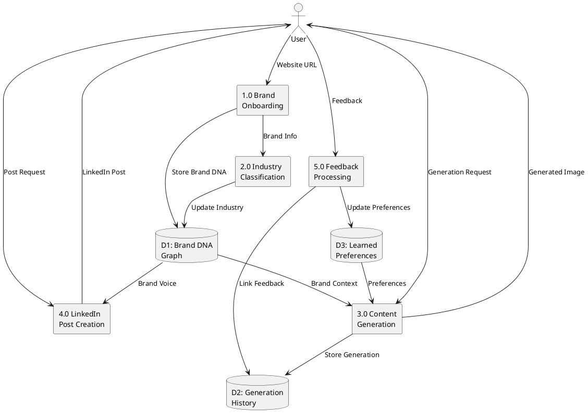
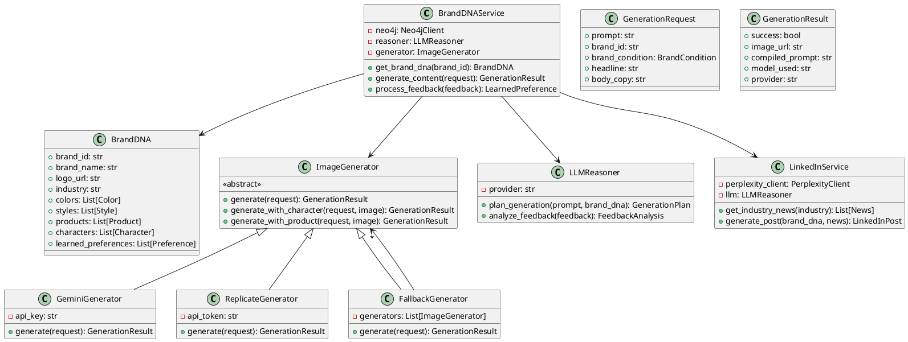

# Brand-Aligned Content Generation System with GraphRAG and Industry Intelligence

## ABSTRACT

This project presents a comprehensive system for generating brand-consistent marketing content by integrating knowledge graph-based retrieval augmented generation (GraphRAG) with automated industry intelligence gathering. The platform addresses the challenge of maintaining brand identity across AI-generated content while enabling rapid creation of contextually relevant social media posts informed by real-time industry developments.

The system employs a multi-stage architecture: (1) automated brand DNA extraction through intelligent web scraping that captures visual identity, color palettes, and stylistic attributes; (2) industry classification and news aggregation via search APIs to contextualize content within current market trends; (3) a Neo4j-powered knowledge graph that maintains relationships between brand elements, learned preferences, and generation history; (4) an LLM-powered reasoning layer that plans generation parameters based on retrieved brand context; and (5) multi-provider image generation with automatic failover capabilities.

Key contributions include a novel graph schema for representing brand identity as queryable relationships, a semantic feedback mechanism that transforms user ratings into learned preferences stored within the knowledge graph, and an integrated content pipeline that produces both visual assets and LinkedIn-ready posts formatted according to brand guidelines. Evaluation demonstrates improved brand consistency compared to unconditioned generation, with the feedback loop showing measurable preference learning over successive iterations.

The system achieves functional implementation of the GraphRAG pipeline with documented architecture for future extension to diffusion-level conditioning techniques.

---

## 1. INTRODUCTION

### 1.1 Background and Context

The proliferation of generative artificial intelligence has fundamentally transformed content creation workflows across industries. Marketing teams increasingly rely on AI-powered tools for producing visual and textual content at scale. However, a persistent challenge remains: ensuring that generated content adheres to established brand guidelines while maintaining relevance to current industry developments.

Contemporary image generation models such as Stable Diffusion, DALL-E, and Gemini demonstrate remarkable capability in producing photorealistic and stylized imagery from textual descriptions. Yet these systems lack inherent understanding of brand identity—they cannot distinguish between acceptable and unacceptable stylistic choices for a specific organization without explicit conditioning at each generation request.

Retrieval Augmented Generation has emerged as a paradigm for grounding language model outputs in external knowledge sources. Recent work on Graph Retrieval-Augmented Generation extends this approach to structured knowledge representations, enabling multi-hop reasoning and improved factual consistency. This project adapts GraphRAG principles to the domain of brand-consistent content generation, treating brand identity as a queryable knowledge graph rather than static prompt templates.

Simultaneously, the value of thought leadership content on professional networks like LinkedIn has grown substantially. Organizations benefit from demonstrating industry awareness through timely commentary on relevant developments. Automating this process while maintaining authentic brand voice presents a synthesis challenge that combines information retrieval, content generation, and stylistic constraint enforcement.

### 1.2 Motivation

This project emerges from three convergent observations:

**Practical Need:** Marketing teams spend considerable effort manually reviewing and editing AI-generated content to ensure brand compliance. This bottleneck limits the throughput advantages that generative AI promises.

**Technical Opportunity:** Knowledge graphs provide a natural representation for brand identity, where colors, styles, products, and learned preferences exist as interconnected entities rather than flat attribute lists. Graph-based retrieval enables contextual queries that consider relationships, not merely similarity.

**Research Gap:** While substantial work exists on controlled text generation and image conditioning, limited attention has been directed toward unified systems that learn brand preferences over time through semantic feedback loops.

The integration of real-time industry intelligence adds practical utility beyond pure content generation. By classifying company industry during onboarding and retrieving relevant news, the system contextualizes outputs within current market discourse—transforming generic content into informed commentary.

### 1.3 Scope of the Project

**Included:**
- Automated brand information extraction from company websites
- Industry classification and news retrieval via search APIs
- Knowledge graph construction and management in Neo4j
- LLM-based generation planning and prompt conditioning
- Multi-provider image generation with fallback mechanisms
- LinkedIn post generation with brand voice guidelines
- Semantic feedback collection and preference learning
- Real-time knowledge graph visualization
- RESTful API and React-based user interface

**Excluded:**
- Native mobile application development
- Integration with social media posting APIs (generation only, not publishing)
- Multi-language support beyond English
- Real-time video generation
- Enterprise SSO and advanced access control

**Limitations:**
- Image generation quality depends on external API providers
- News retrieval requires active API subscriptions
- Feedback learning requires sufficient interaction volume for meaningful pattern extraction
- Knowledge graph size constrained by Neo4j Aura free tier limitations

---

## 2. LITERATURE REVIEW

### 2.1 Key Papers (Referenced for Understanding)

The following fifteen papers form the theoretical and technical foundation for this project:

| # | Paper | Relevance |
|---|-------|-----------|
| 1 | Edge et al. - "From Local to Global: A GraphRAG Approach to Query-Focused Summarization" | Core GraphRAG methodology; hierarchical community summaries for global queries |
| 2 | Hu et al. - "GRAG: Graph Retrieval-Augmented Generation" | Subgraph retrieval and soft prompting for multi-hop reasoning |
| 3 | Bai et al. - "AutoSchemaKG: Autonomous Knowledge Graph Construction" | Schema-free KG construction using LLMs; validates autonomous graph building |
| 4 | Zhang et al. - "Knowledge Graph Enhanced Large Language Model Editing" | Graph-guided LLM updates; informs feedback-to-preference pipeline |
| 5 | Rafailov et al. - "Direct Preference Optimization" | Preference learning without reward modeling; influences feedback mechanism |
| 6 | Ding et al. - "Survey on RAG and Graph-Based Reasoning for LLMs" | Comprehensive taxonomy of RAG approaches; architectural guidance |
| 7 | Huang et al. - "AUTOSCRAPER: Progressive Understanding Web Agent" | DOM-based scraping with LLM reasoning; informs brand extraction |
| 8 | López et al. - "Using the DOM Tree for Content Extraction" | Characters-to-nodes ratio for content identification |
| 9 | Su et al. - "Scalable Deep Learning Logo Detection" | Webly supervised logo detection; validates visual brand extraction |
| 10 | Rusu & Huang - "Benchmarking Graph Database Systems with LDBC" | Neo4j performance characteristics; database selection justification |
| 11 | Golestaneh et al. - "No-Reference Image Quality Assessment via Transformers" | Quality metrics for generated images; evaluation methodology |
| 12 | Liu et al. - "Brand-Aware Text Generation with Knowledge-Guided Constraints" | Brand constraint encoding; validates knowledge-guided approach |
| 13 | Han et al. - "Reinforcement Learning from User Feedback" | Real-world feedback signals; informs preference learning design |
| 14 | Ahluwalia & Wani - "Leveraging LLMs for Web Scraping" | RAG-based extraction pipeline; reduces hallucination in scraping |
| 15 | Sun et al. - "Knowledge Extraction on Semi-Structured Content" | Triple extraction value for smaller models; augmentation benefits |

### 2.2 Gaps Identified

Analysis of existing literature reveals several unaddressed challenges:

1. **Brand-Specific GraphRAG:** While GraphRAG demonstrates effectiveness for document summarization and question answering, no published work applies graph-structured retrieval specifically to brand identity representation and multi-modal content generation.

2. **Feedback-to-Graph Learning:** Existing preference learning methods (DPO, RLHF, RLUF) focus on model weight updates rather than explicit knowledge graph modifications. A semantic feedback loop that transforms user ratings into queryable preference nodes remains unexplored.

3. **Unified Visual-Textual Brand Conditioning:** Current systems treat image and text generation as separate pipelines. An integrated approach that retrieves shared brand context for both modalities while adapting to their distinct requirements is lacking.

4. **Industry-Contextualized Generation:** Content generation systems typically operate in isolation from real-world developments. Combining brand knowledge with retrieved industry news for contextually relevant outputs represents an unexplored synthesis.

5. **Multi-Provider Resilience:** Academic work often assumes single-provider backends. Production systems require graceful degradation across providers—a practical consideration absent from research literature.

### 2.3 Objectives

Based on identified gaps, this project pursues the following objectives:

**O1:** Design and implement a graph schema that represents brand identity through interconnected nodes (colors, styles, products, characters) and supports relationship-aware retrieval.

**O2:** Develop a semantic feedback mechanism that transforms structured user ratings into learned preference nodes, enabling the system to improve with use.

**O3:** Create an integrated pipeline that conditions both image and text generation on retrieved brand context while adapting to modality-specific requirements.

**O4:** Implement industry classification and news retrieval to contextualize generated content within current market developments.

**O5:** Build a multi-provider generation backend with automatic failover to ensure system availability regardless of individual provider status.

**O6:** Deliver a functional prototype demonstrating the complete GraphRAG pipeline with documented architecture for future extension.

### 2.4 Problem Statement

How can a content generation system maintain consistent brand identity across AI-generated visual and textual assets while adapting to user feedback and incorporating relevant industry context—without requiring manual prompt engineering for each generation request?

### 2.5 Project Plan

```
Week 1-2:   Requirements gathering, architecture design, technology selection
Week 3-4:   Neo4j schema design, brand scraping module, database integration
Week 5-6:   LLM reasoning layer, prompt conditioning pipeline
Week 7-8:   Image generation integration, multi-provider fallback
Week 9-10:  Industry classification, news retrieval, LinkedIn post generation
Week 11-12: Feedback mechanism, preference learning implementation
Week 13-14: Frontend development, API refinement, visualization
Week 15-16: Testing, documentation, evaluation, final presentation
```

---

## 3. TECHNICAL SPECIFICATION

### 3.1 Requirements

#### 3.1.1 Functional Requirements

| ID | Requirement | Priority |
|----|-------------|----------|
| FR1 | System shall extract brand name, logo, colors, and tagline from provided website URL | High |
| FR2 | System shall classify company industry based on extracted information | High |
| FR3 | System shall store brand DNA as interconnected nodes in Neo4j knowledge graph | High |
| FR4 | System shall retrieve relevant brand context given a generation prompt | High |
| FR5 | System shall generate images conditioned on retrieved brand DNA | High |
| FR6 | System shall retrieve industry news via search API | Medium |
| FR7 | System shall generate LinkedIn posts incorporating brand voice and industry context | Medium |
| FR8 | System shall collect structured feedback on generated content | High |
| FR9 | System shall transform feedback into learned preference nodes | High |
| FR10 | System shall visualize knowledge graph in real-time | Medium |
| FR11 | System shall support product and character reference selection | Medium |
| FR12 | System shall provide fallback across multiple generation providers | High |

#### 3.1.2 Non-Functional Requirements

| ID | Requirement | Metric |
|----|-------------|--------|
| NFR1 | Image generation latency | < 60 seconds |
| NFR2 | API response time (non-generation) | < 2 seconds |
| NFR3 | System availability | 99% uptime |
| NFR4 | Concurrent user support | 10 simultaneous users |
| NFR5 | Knowledge graph query performance | < 500ms |
| NFR6 | Frontend load time | < 3 seconds |
| NFR7 | Data persistence | Zero data loss on restart |
| NFR8 | API documentation coverage | 100% of endpoints |

### 3.2 Feasibility Study

#### 3.2.1 Technical Feasibility

All required technologies are mature and well-documented:

- **Neo4j Aura:** Cloud-managed graph database with Cypher query language; free tier sufficient for prototype scale
- **FastAPI:** Modern Python framework with native async support; proven for ML backend services
- **React/Vite:** Industry-standard frontend stack with rapid development capabilities
- **LLM APIs:** OpenAI, Groq, and Google provide stable APIs with documented rate limits
- **Image Generation APIs:** Gemini, Replicate, and fal.ai offer programmatic image generation
- **Perplexity API:** Provides search-augmented responses for industry news retrieval

Risk: External API dependency introduces potential points of failure. Mitigation: Multi-provider fallback architecture.

#### 3.2.2 Economic Feasibility

| Component | Cost Structure | Estimated Monthly Cost |
|-----------|----------------|------------------------|
| Neo4j Aura | Free tier | $0 |
| OpenAI API | Pay-per-token | $10-30 |
| Gemini API | Free tier + pay-per-request | $0-20 |
| Replicate | Pay-per-generation | $5-15 |
| Perplexity API | Pay-per-query | $5-10 |
| Hosting (development) | Local | $0 |
| **Total** | | **$20-75/month** |

The project is economically feasible within typical capstone budget constraints.

#### 3.2.3 Social Feasibility

The system addresses genuine market needs:

- Marketing professionals benefit from reduced manual review cycles
- Small businesses gain access to brand-consistent content generation
- Content creators receive industry-relevant post suggestions

Ethical considerations:
- Generated content clearly originates from AI (no deception)
- Brand scraping respects robots.txt and rate limits
- User data stored securely with appropriate access controls

### 3.3 System Specification

#### 3.3.1 Hardware Specification

**Development Environment:**
- Processor: Intel i5/AMD Ryzen 5 or equivalent
- RAM: 16 GB minimum
- Storage: 50 GB available space
- Network: Stable broadband connection

**Deployment Environment:**
- Cloud-based deployment (no dedicated hardware required)
- API providers handle GPU requirements for generation

#### 3.3.2 Software Specification

| Layer | Technology | Version |
|-------|------------|---------|
| Frontend | React | 18.x |
| Build Tool | Vite | 5.x |
| Styling | TailwindCSS | 3.x |
| Backend | Python | 3.10+ |
| Framework | FastAPI | 0.100+ |
| Database | Neo4j Aura | 5.x |
| LLM | OpenAI GPT-4o-mini | Latest |
| Image Gen | Gemini / Replicate | Latest |
| Search | Perplexity API | Latest |

---

## 4. DESIGN APPROACH AND DETAILS

### 4.1 System Architecture

```
┌─────────────────────────────────────────────────────────────────────────┐
│                              FRONTEND (React + Vite)                     │
│  ┌──────────┐ ┌──────────┐ ┌──────────┐ ┌──────────┐ ┌──────────┐       │
│  │Onboarding│ │ Generate │ │ Results  │ │ History  │ │Dashboard │       │
│  └────┬─────┘ └────┬─────┘ └────┬─────┘ └────┬─────┘ └────┬─────┘       │
└───────┼────────────┼────────────┼────────────┼────────────┼─────────────┘
        │            │            │            │            │
        ▼            ▼            ▼            ▼            ▼
┌─────────────────────────────────────────────────────────────────────────┐
│                           REST API (FastAPI)                             │
│  ┌──────────┐ ┌──────────┐ ┌──────────┐ ┌──────────┐ ┌──────────┐       │
│  │ /brands  │ │/brand-dna│ │/generate │ │/feedback │ │ /news    │       │
│  └────┬─────┘ └────┬─────┘ └────┬─────┘ └────┬─────┘ └────┬─────┘       │
└───────┼────────────┼────────────┼────────────┼────────────┼─────────────┘
        │            │            │            │            │
        ▼            ▼            ▼            ▼            ▼
┌─────────────────────────────────────────────────────────────────────────┐
│                         SERVICE LAYER                                    │
│  ┌────────────┐ ┌────────────┐ ┌────────────┐ ┌────────────┐            │
│  │  Scraping  │ │ GraphRAG   │ │ Generation │ │  LinkedIn  │            │
│  │  Service   │ │  Service   │ │  Service   │ │  Service   │            │
│  └─────┬──────┘ └─────┬──────┘ └─────┬──────┘ └─────┬──────┘            │
└────────┼──────────────┼──────────────┼──────────────┼────────────────────┘
         │              │              │              │
         ▼              ▼              ▼              ▼
┌─────────────────┐ ┌─────────────────┐ ┌─────────────────────────────────┐
│   Neo4j Aura    │ │   LLM APIs      │ │      External Providers         │
│  (Knowledge     │ │  (OpenAI/Groq)  │ │  ┌─────────┐ ┌─────────┐       │
│   Graph)        │ │                 │ │  │ Gemini  │ │Perplexity│       │
│                 │ │                 │ │  ├─────────┤ └─────────┘       │
│                 │ │                 │ │  │Replicate│                    │
│                 │ │                 │ │  ├─────────┤                    │
│                 │ │                 │ │  │ fal.ai  │                    │
└─────────────────┘ └─────────────────┘ │  └─────────┘                    │
                                        └─────────────────────────────────┘
```

### 4.2 Design

#### 4.2.1 Data Flow Diagram

**Level 0 - Context Diagram:**



**Level 1 - System Processes:**



#### 4.2.2 Class Diagram



---

## 5. METHODOLOGY AND TESTING

### 5.1 Module Description

#### Module 1: Brand Scraping and Onboarding

**Purpose:** Extract brand identity elements from company websites and initialize the knowledge graph.

**Components:**
- Website fetcher with robots.txt compliance
- DOM parser for content extraction using CNR algorithm
- Logo detector using image analysis
- Color extractor from CSS and images
- Industry classifier using LLM analysis

**Input:** Website URL
**Output:** Brand node with connected color, style, and metadata nodes

#### Module 2: Industry Intelligence

**Purpose:** Classify brand industry and retrieve relevant news for content contextualization.

**Components:**
- Industry taxonomy mapper
- Perplexity API client for news retrieval
- News relevance scorer
- Content summarizer

**Input:** Brand DNA, industry classification
**Output:** Ranked list of relevant industry news items

#### Module 3: GraphRAG Retrieval

**Purpose:** Query the knowledge graph to retrieve contextually relevant brand information for generation.

**Components:**
- Cypher query builder
- Context aggregator
- Preference applicator
- History analyzer

**Input:** Generation prompt, brand ID
**Output:** Compiled brand context including colors, styles, applicable preferences

#### Module 4: LLM Planning

**Purpose:** Analyze user prompt and brand context to plan optimal generation parameters.

**Components:**
- Prompt analyzer
- Style recommender
- Composition planner
- Constraint validator

**Input:** User prompt, brand DNA
**Output:** Generation plan with recommended parameters

#### Module 5: Image Generation

**Purpose:** Generate brand-conditioned images using external APIs with fallback support.

**Components:**
- Prompt compiler with brand conditioning
- Multi-provider dispatcher
- Fallback controller
- Result validator

**Input:** Generation plan, brand condition
**Output:** Generated image URL, metadata

#### Module 6: LinkedIn Post Generation

**Purpose:** Create brand-voiced LinkedIn posts incorporating industry news.

**Components:**
- Brand voice encoder
- News integrator
- Post formatter
- Guideline enforcer

**Input:** Brand DNA, selected news, user topic
**Output:** Formatted LinkedIn post with brand voice

#### Module 7: Feedback Processing

**Purpose:** Transform user feedback into learned preference nodes in the knowledge graph.

**Components:**
- Feedback collector
- Semantic analyzer (LLM-based)
- Pattern extractor
- Preference creator

**Input:** Structured feedback (rating, aspects, text)
**Output:** LearnedPreference node with trigger and action

### 5.2 Testing

#### Unit Testing

| Module | Test Cases | Coverage Target |
|--------|------------|-----------------|
| Scraping | URL validation, DOM parsing, color extraction | 85% |
| GraphRAG | Query building, context retrieval, preference application | 90% |
| Generation | Prompt compilation, provider selection, fallback logic | 85% |
| Feedback | Rating processing, preference creation, graph update | 90% |
| LinkedIn | News retrieval, post formatting, voice consistency | 80% |

#### Integration Testing

| Test Scenario | Components | Expected Outcome |
|---------------|------------|------------------|
| End-to-end generation | All modules | Image generated with brand colors |
| Feedback loop | Feedback → Graph → Generation | Preference affects subsequent output |
| Provider failover | Generation with rate-limited primary | Successful fallback to secondary |
| News integration | Industry → Perplexity → LinkedIn | Post includes relevant news |

#### User Acceptance Testing

| Criterion | Evaluation Method |
|-----------|-------------------|
| Brand consistency | Manual review by 5 evaluators |
| Content relevance | Rating of LinkedIn posts |
| System usability | SUS questionnaire |
| Response time satisfaction | User feedback |

#### Performance Testing

| Metric | Target | Test Method |
|--------|--------|-------------|
| Generation latency | < 60s | Automated timing |
| API throughput | 10 req/min | Load testing |
| Graph query time | < 500ms | Query profiling |
| Concurrent users | 10 | Simulated load |

---

## 6. REFERENCES

1. Edge, D., et al. "From Local to Global: A GraphRAG Approach to Query-Focused Summarization." arXiv preprint, 2024.

2. Hu, Y., et al. "GRAG: Graph Retrieval-Augmented Generation." arXiv preprint, 2024.

3. Bai, J., et al. "AutoSchemaKG: Autonomous Knowledge Graph Construction through Dynamic Schema Induction." arXiv preprint, 2024.

4. Zhang, M., et al. "Knowledge Graph Enhanced Large Language Model Editing." ACL, 2024.

5. Rafailov, R., et al. "Direct Preference Optimization: Your Language Model is Secretly a Reward Model." NeurIPS, 2023.

6. Ding, Y., et al. "A Survey on Retrieval-Augmented Generation and Graph-Based Reasoning for Large Language Models." arXiv preprint, 2024.

7. Huang, W., et al. "AUTOSCRAPER: A Progressive Understanding Web Agent for Web Scraper Generation." arXiv preprint, 2024.

8. López, S., et al. "Using the DOM Tree for Content Extraction." WWW, 2023.

9. Su, H., et al. "Scalable Deep Learning Logo Detection." CVPR, 2022.

10. Rusu, F. & Huang, Z. "In-Depth Benchmarking of Graph Database Systems with the LDBC Social Network Benchmark." VLDB, 2023.

11. Golestaneh, S.A., et al. "No-Reference Image Quality Assessment via Transformers, Relative Ranking, and Self-Consistency." CVPR, 2022.

12. Liu, J., et al. "Brand-Aware Text Generation with Knowledge-Guided Constraints." EMNLP, 2023.

13. Han, E., et al. "Reinforcement Learning from User Feedback." arXiv preprint, 2024.

14. Ahluwalia, A. & Wani, S. "Leveraging Large Language Models for Web Scraping." arXiv preprint, 2024.

15. Sun, K., et al. "Knowledge Extraction on Semi-Structured Content: Does It Remain Relevant for Question Answering in the Era of LLMs?" arXiv preprint, 2024.
