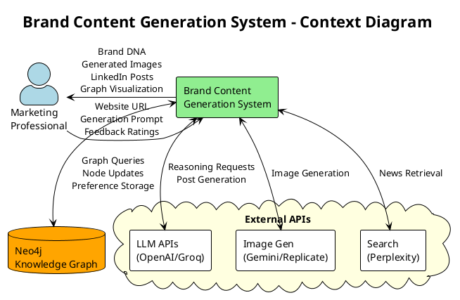
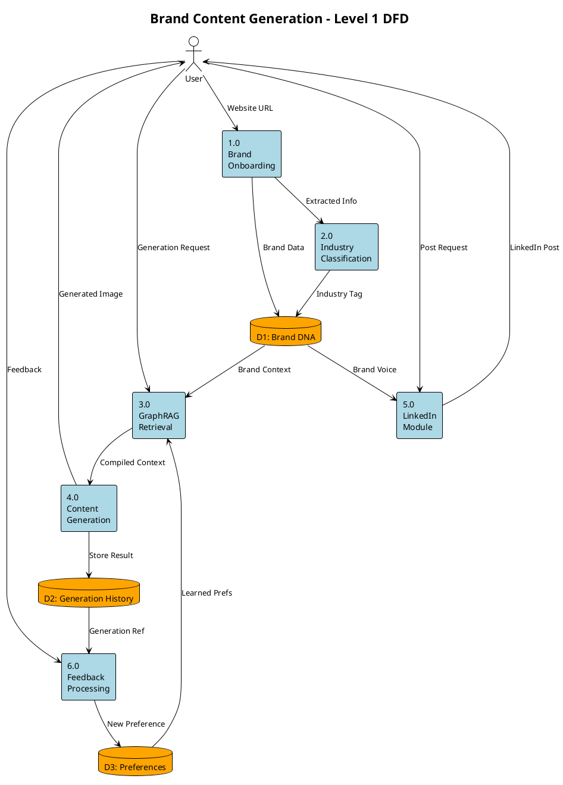
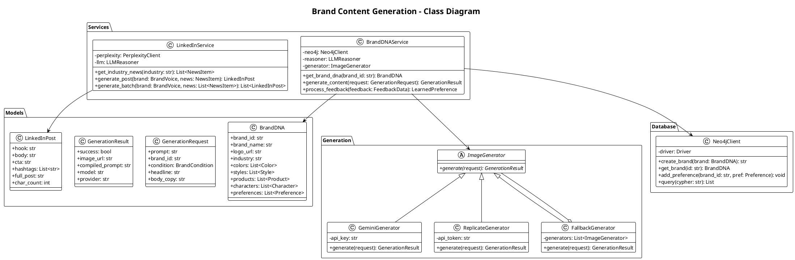
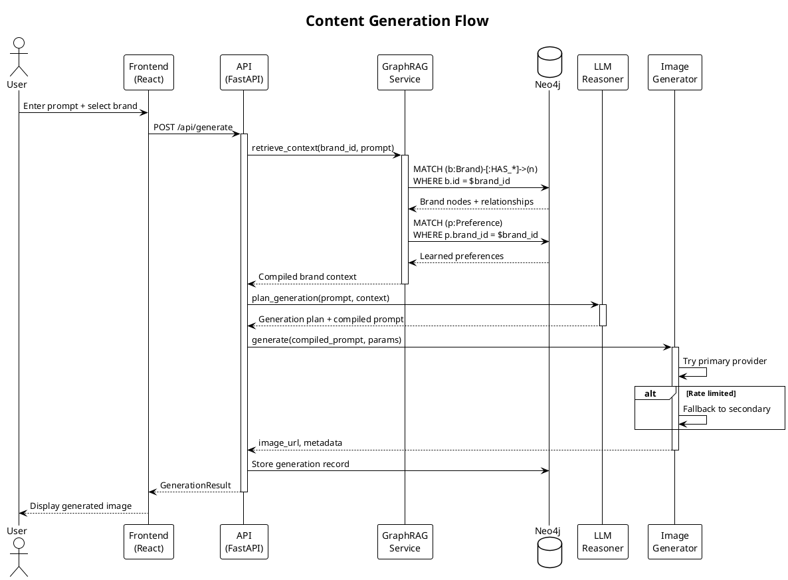
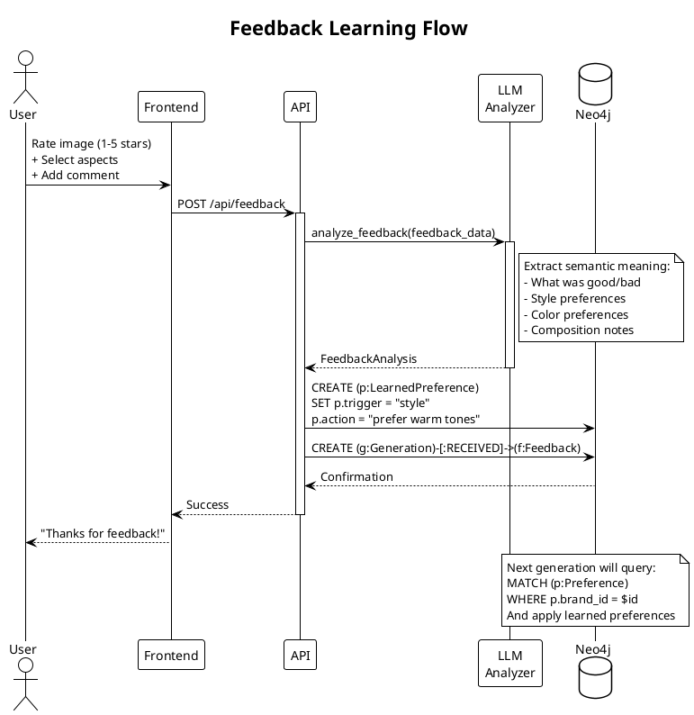
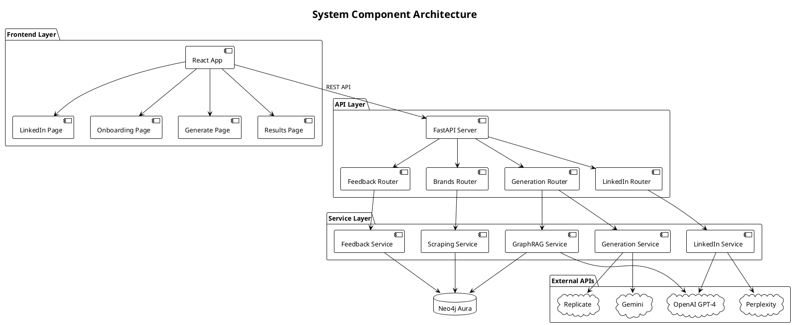
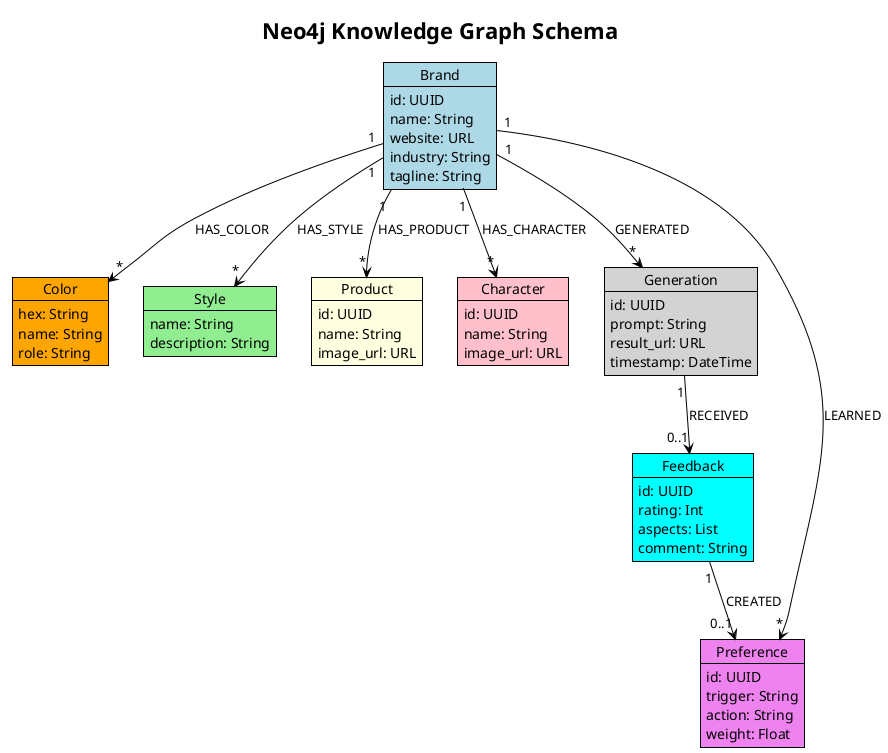
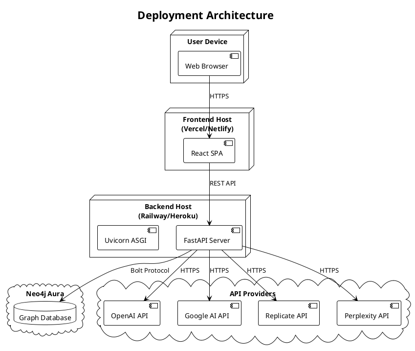

# System Design Diagrams

This document contains PlantUML diagrams for the Brand-Aligned Content Generation System. These can be rendered using:
- PlantUML extension in VS Code
- Online at https://www.plantuml.com/plantuml/uml/
- Draw.io import

---

## 1. Context Diagram (Level 0 DFD)



---

## 2. Level 1 Data Flow Diagram



---

## 3. Class Diagram



---

## 4. Sequence Diagram - Content Generation Flow



---

## 5. Sequence Diagram - Feedback Loop



---

## 6. Component Diagram



---

## 7. Knowledge Graph Schema



---

## 8. Deployment Diagram



---

## Rendering Instructions

### VS Code
1. Install "PlantUML" extension
2. Open this file
3. Press `Alt+D` to preview diagrams

### Online
1. Visit https://www.plantuml.com/plantuml/uml/
2. Copy diagram code (between ```plantuml and ```)
3. Paste and render

### Export
- PNG: Right-click rendered diagram → Export
- SVG: Use PlantUML CLI with `-tsvg` flag
